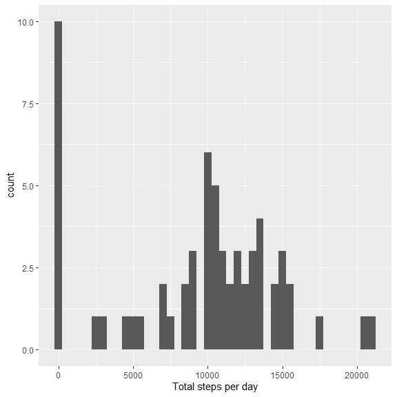
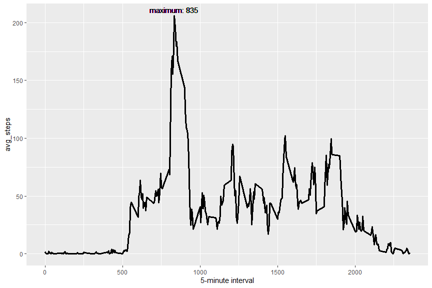
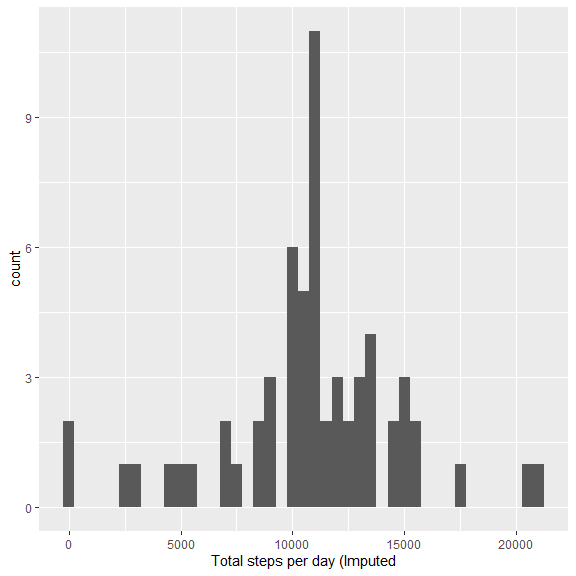
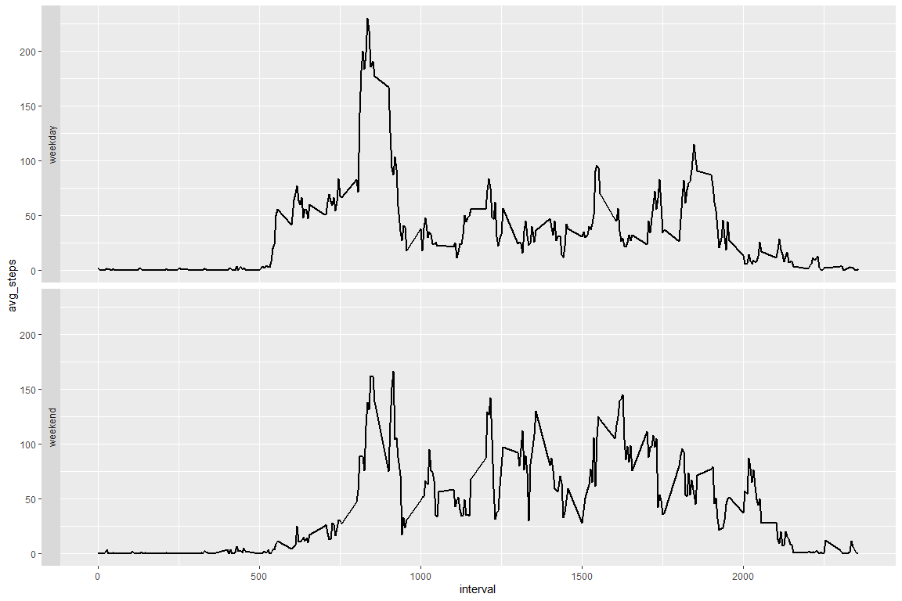

## Loading and preprocessing the data

```r
suppressPackageStartupMessages(library(tidyverse))

# load the data
unzip(zipfile = "activity.zip", files = "activity.csv")
df <- read.csv("activity.csv", stringsAsFactors = FALSE)

# formatting date
df$date <- as.Date(df$date, format = "%Y-%m-%d")

head(df)
```

```
##   steps       date interval
## 1    NA 2012-10-01        0
## 2    NA 2012-10-01        5
## 3    NA 2012-10-01       10
## 4    NA 2012-10-01       15
## 5    NA 2012-10-01       20
## 6    NA 2012-10-01       25
```


## What is mean total number of steps taken per day?

```r
# calculate the total number of steps taken per day
n_steps_day <- df %>% group_by(date) %>% summarise(tt_steps = sum(steps, na.rm = TRUE)) %>% ungroup()

mean_steps_day <- format(round(mean(n_steps_day$tt_steps)), big.mark=",")
median_steps_day <- format(median(n_steps_day$tt_steps), big.mark=",")

ggplot(data = n_steps_day, aes(x = date, y = tt_steps)) + 
  geom_col()
```

<!-- -->

The mean of the total number of steps taken per day is **9,354** and the median is **10,395**.


## What is the average daily activity pattern?

```r
# calculate the average number of steps taken in the 5-minute interval
avg_steps_5mins <- df %>% group_by(interval) %>% summarise(avg_steps = mean(steps, na.rm = TRUE)) %>% ungroup()
max_steps_5mins <- avg_steps_5mins[[which.max(avg_steps_5mins$avg_steps), "interval"]]

ggplot(data = avg_steps_5mins) + 
  geom_line(aes(x = interval, y = avg_steps), size = 1.2) + 
  geom_text(x = max_steps_5mins, y = round(max(avg_steps_5mins$avg_steps)+5), label = paste("maximum:", as.character(max_steps_5mins)))
```

<!-- -->

The 5-minute interval which contains the maximum number of steps on average across all the days is **835**.

## Imputing missing values

```r
# calculate the total number of missing values in the dataset
n_missing_values <- df %>% filter(is.na(steps)) %>% nrow() %>% format(., big.mark=",")
```
The total number of missing values in the dataset is **2,304**.


```r
# fill in all of the missing values in the dataset by the mean for that 5-minute interval
df_new <- df %>% group_by(interval) %>% mutate(steps = if_else(is.na(steps), as.integer(round(mean(steps, na.rm = TRUE))), steps))

# calculate the total number of steps taken per day (after the imputing missing data)
n_steps_day_new <- df_new %>% group_by(date) %>% summarise(tt_steps = sum(steps)) %>% ungroup()

mean_steps_day_new <- format(round(mean(n_steps_day_new$tt_steps)), big.mark=",")
median_steps_day_new <- format(median(n_steps_day_new$tt_steps), big.mark=",")

ggplot(data = n_steps_day_new, aes(x = date, y = tt_steps)) + 
  geom_col()
```

<!-- -->

The mean of the total number of steps taken per day (after the imputing missing data) is **10,766** and the median is **10,762**.
These values differ from the estimates from the first part of the assignment, imputing missing data increase the mean and the median of the total daily number of steps.

## Are there differences in activity patterns between weekdays and weekends?


```r
df_new <- df_new %>% mutate(week_flag = as.factor(if_else(weekdays(date) %in% c("samedi", "dimanche"), "weekend", "weekday")))
ggplot(df_new %>% group_by(week_flag, interval) %>% summarise(avg_steps = mean(steps)), aes(x = interval, y = avg_steps)) + 
  geom_line(size = 1) +
  facet_grid(week_flag~., switch = "y")
```

<!-- -->
